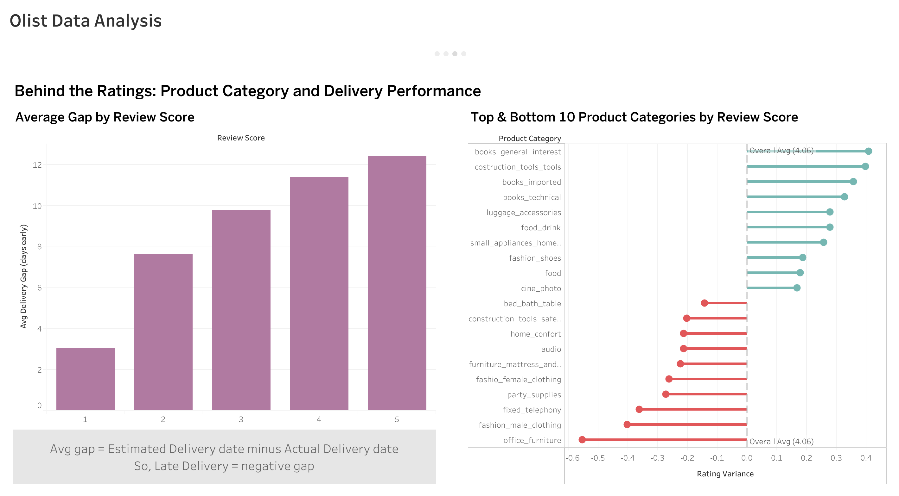
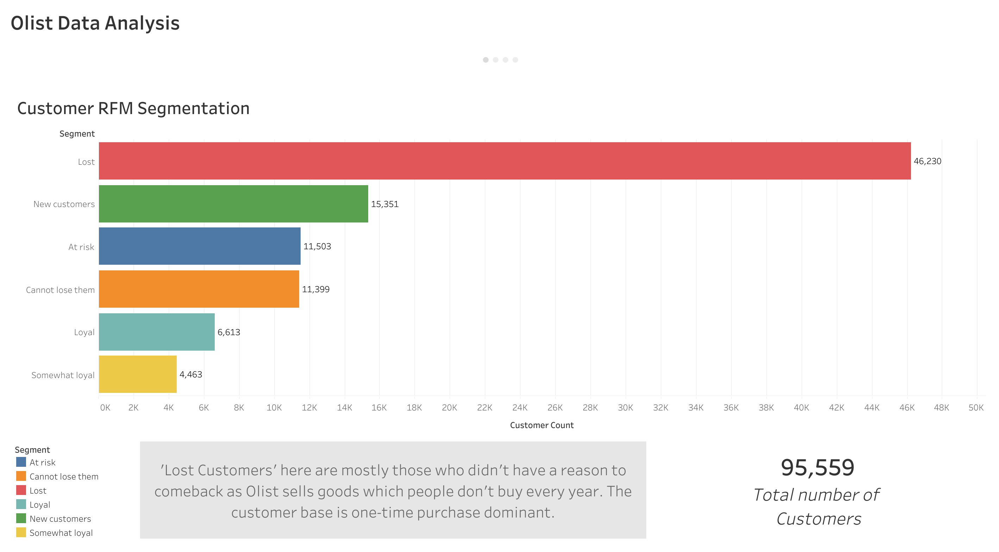

# Olist E-Commerce Data Analysis

End-to-end analysis of the Olist Brazilian e-commerce marketplace dataset — from raw data in PostgreSQL to an interactive Tableau Public dashboard.

## Live Dashboard
[View Interactive Dashboard on Tableau Public](https://public.tableau.com/views/OlistE-commerceDataAnalysis_17831688711120/Story1?:language=en-GB&:sid=&:redirect=auth&publish=yes&showOnboarding=true&:display_count=n&:origin=viz_share_link)

## Dashboard Preview

## Overview

Olist is a Brazilian e-commerce marketplace connecting small businesses to major retail channels. This project analyzes ~100K orders (2016–2018) across customers, sellers, products, reviews, and logistics to answer:

* How has revenue grown, and what product categories drive it?
* Who are Olist's customers, and how loyal are they?
* Does delivery performance affect customer satisfaction?
* Are top-rated sellers actually driving more revenue?

## Tech Stack

* Database: PostgreSQL
* Analysis: SQL, Python (Pandas, NumPy, Matplotlib, Seaborn)
* Environment: VS Code + Jupyter, SQLAlchemy, python-dotenv
* Dashboard: Tableau Public

## Key Insights

1. Revenue Growth — Monthly revenue grew from near-zero at late-2016 to a peak of ~R$1.3M/month by late 2017, led by the health_beauty, watches_gifts, and bed_bath_table categories. 
2. Customer Segmentation (RFM) — Of ~95,500 customers, most fall into the "Lost" segment — consistent with Olist's customer base being one-time purchase dominant. 
3. Delivery & Reviews — Orders delivered earlier than their estimate delivery date consistently earn higher review scores, and specific categories (e.g. office_furniture, fashion_male_clothing) underperform the platform's average rating. 
4. Seller Quality — Sellers rated 4+ stars generate 65.8% of total platform revenue out of 3,090 active sellers on the platform. 

## How to Reproduce

1. Clone this repo and create a .env file (see .env.example) with your PostgreSQL connection string. 
2. Load the Olist Brazilian E-Commerce dataset from Kaggle([Olist Dataset](https://www.kaggle.com/datasets/olistbr/brazilian-ecommerce)) into PostgreSQL. 
3. Run the notebooks in notebooks/ in order — each one answers a specific business question and exports a dataframe as clean CSV. 
4. Open the Tableau workbook (or the live link above) to explore the dashboards and story. 

## Skills Demonstrated

SQL (aggregation, joins, HAVING/window logic) · Cleaning data with Python · RFM segmentation · Exploratory data analysis · Chart design (Matplotlib/Seaborn) · Dashboard design & data storytelling (Tableau)